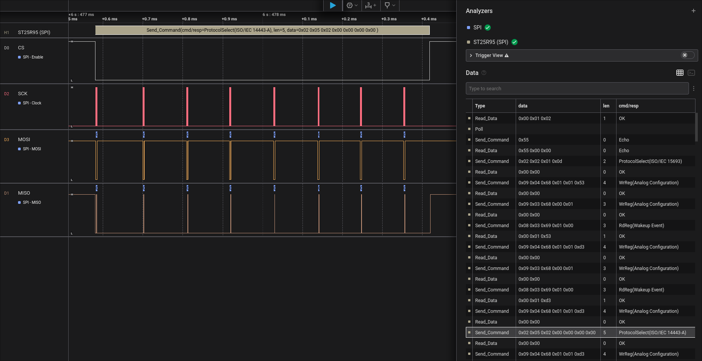

# ST25R95 (SPI)
High Level Analyzer for STMicroelectronics ST25R95 NFC chip on SPI bus with Saleae Logic analyzer

## References
- [https://www.st.com/en/nfc/st25r95.html](https://www.st.com/en/nfc/st25r95.html)
- [https://www.saleae.com](https://www.saleae.com)

## License

Licensed under either of the [Apache License, Version 2.0](LICENSE-APACHE) or the
[MIT license](LICENSE-MIT), at your option.
